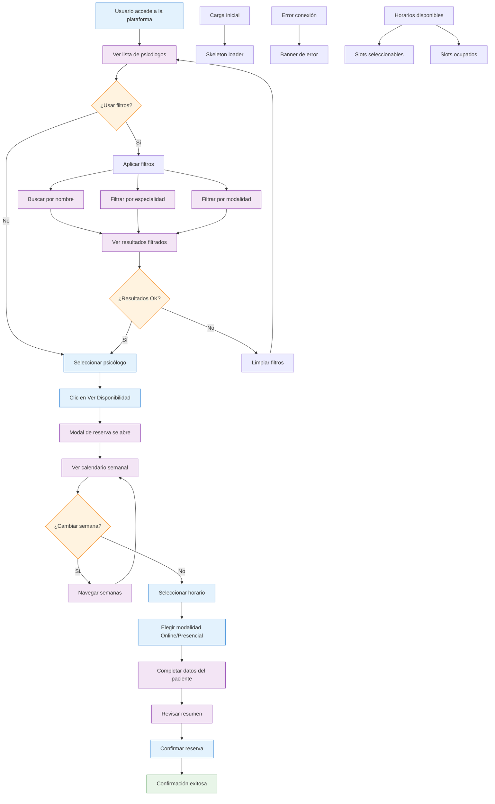

# Documento Funcional - Psimammoliti Online

## Descripción General

Psimammoliti Online es una plataforma web para la reserva de sesiones de psicología que permite a los usuarios encontrar y agendar citas con psicólogos profesionales, tanto en modalidad online como presencial.

## Flowchart

## Funcionalidades Principales

### 1. Visualización de Psicólogos

**¿Qué se puede hacer?**
- Ver una lista completa de psicólogos disponibles
- Consultar información detallada de cada profesional:
  - Nombre y foto de perfil
  - Años de experiencia
  - Calificación (sistema de estrellas)
  - Especialidades
  - Descripción profesional
  - Precio por sesión (50 minutos)
  - Modalidades disponibles (Online/Presencial)

**¿Cómo funciona?**
- Los psicólogos se muestran en tarjetas organizadas en una cuadrícula responsiva
- Cada tarjeta incluye un indicador de disponibilidad
- Se muestra un resumen de las modalidades ofrecidas por cada profesional

### 2. Sistema de Filtros y Búsqueda

**¿Qué se puede hacer?**
- Buscar psicólogos por nombre o especialidad
- Filtrar por especialidad específica
- Filtrar por modalidad de sesión (Online/Presencial/Todas)
- Limpiar filtros activos individualmente
- Ver contador de resultados en tiempo real

**¿Cómo funciona?**
- Búsqueda en tiempo real mientras se escribe
- Filtros combinables para refinar resultados
- Badges visuales que muestran filtros activos
- Botón de reset para limpiar todos los filtros

**Especialidades disponibles:**
- Fobias
- Depresión
- Ansiedad Social
- Relaciones Personales
- Terapia de Pareja
- Estrés Laboral
- Autoestima
- Duelo
- Trauma
- Burnout
- Comunicación

### 3. Sistema de Reservas

**¿Qué se puede hacer?**
- Ver disponibilidad semanal de cada psicólogo
- Navegar entre semanas (anterior/siguiente)
- Seleccionar horarios disponibles
- Elegir entre modalidades online y presencial
- Completar información del paciente
- Confirmar la reserva

**¿Cómo funciona?**
- Calendario semanal con vista desktop y móvil optimizada
- Horarios mostrados en la zona horaria del usuario
- Slots ocupados claramente marcados como no disponibles
- Formulario de paciente con validación
- Resumen de la cita antes de confirmar

### 4. Gestión de Horarios

**¿Qué se puede hacer?**
- Ver horarios en la zona horaria local del usuario
- Identificar slots ya reservados
- Filtrar horarios pasados automáticamente
- Ver disponibilidad por día de la semana

**¿Cómo funciona?**
- Detección automática de zona horaria del navegador
- Conversión de horarios UTC a hora local
- Ocultación automática de horarios pasados
- Indicadores visuales para diferentes estados de disponibilidad

### 5. Proceso de Confirmación

**¿Qué se puede hacer?**
- Recibir confirmación inmediata de la reserva
- Ver todos los detalles de la cita agendada
- Obtener información sobre próximos pasos

**¿Cómo funciona?**
- Modal de confirmación con detalles completos
- Información específica según modalidad (online/presencial)
- Instrucciones claras para el día de la sesión

## Flujos de Usuario Cubiertos

### Flujo Principal: Reserva de Sesión

1. **Entrada a la plataforma**
   - El usuario accede a la página principal
   - Ve el header con información de la plataforma
   - Observa las características principales (confidencial, online, presencial, 24/7)

2. **Exploración de psicólogos**
   - Visualiza la lista completa de profesionales
   - Puede usar filtros para refinar la búsqueda
   - Lee información detallada de cada psicólogo

3. **Selección de profesional**
   - Hace clic en "Ver Disponibilidad"
   - Se abre el modal de reserva con información del psicólogo

4. **Selección de horario**
   - Navega por las semanas disponibles
   - Ve los horarios en su zona horaria local
   - Selecciona un slot disponible (online o presencial)

5. **Información del paciente**
   - Completa nombre completo
   - Proporciona correo electrónico
   - Revisa el resumen de la cita

6. **Confirmación**
   - Confirma la reserva
   - Recibe confirmación inmediata
   - Ve los próximos pasos según la modalidad

### Flujo de Búsqueda y Filtrado

1. **Búsqueda por texto**
   - Escribe en el campo de búsqueda
   - Ve resultados filtrados en tiempo real
   - Puede limpiar la búsqueda

2. **Filtrado por especialidad**
   - Selecciona una especialidad del dropdown
   - Ve solo psicólogos con esa especialidad
   - Puede cambiar o limpiar el filtro

3. **Filtrado por modalidad**
   - Selecciona Online, Presencial o Todas
   - Ve solo psicólogos que ofrecen esa modalidad
   - Puede combinar con otros filtros

### Flujo de Navegación Temporal

1. **Vista semanal actual**
   - Ve la semana actual por defecto
   - Horarios pasados se ocultan automáticamente

2. **Navegación entre semanas**
   - Usa botones anterior/siguiente
   - Ve fechas actualizadas en el header
   - Mantiene la selección de psicólogo

### Flujo Responsivo

1. **Vista desktop**
   - Calendario en cuadrícula de 7 días
   - Filtros en línea horizontal
   - Modal amplio con toda la información

2. **Vista móvil**
   - Calendario en lista vertical por día
   - Filtros apilados verticalmente
   - Modal optimizado para pantalla pequeña

## Estados del Sistema

### Estados de Carga
- **Carga inicial**: Skeleton loader mientras se obtienen datos
- **Carga de reserva**: Indicador durante el proceso de reserva

### Estados de Error
- **Error de conexión**: Banner informativo con opción de reintentar
- **Modo demo**: Banner cuando la base de datos no está disponible

### Estados de Disponibilidad
- **Disponible**: Slot seleccionable con horario y modalidad
- **Ocupado**: Slot marcado como reservado, no seleccionable
- **Pasado**: Slots en el pasado se ocultan automáticamente

### Estados de Filtros
- **Sin filtros**: Muestra todos los psicólogos
- **Con filtros activos**: Muestra badges de filtros aplicados
- **Sin resultados**: Estado vacío con opción de limpiar filtros

## Características Técnicas

### Responsividad
- Diseño adaptativo para desktop, tablet y móvil
- Componentes optimizados para cada tamaño de pantalla
- Navegación táctil en dispositivos móviles

### Accesibilidad
- Navegación por teclado
- Lectores de pantalla compatibles
- Contraste adecuado en todos los elementos
- Textos alternativos en imágenes

### Internacionalización
- Interfaz completamente en español
- Formatos de fecha y hora localizados
- Zona horaria automática del usuario

### Persistencia de Datos
- Reservas almacenadas en base de datos
- Sincronización en tiempo real de disponibilidad
- Fallback a datos de demostración si la BD no está disponible

## Limitaciones Actuales

1. **Pagos**: No incluye procesamiento de pagos (se muestra solo el precio)
2. **Autenticación**: No requiere registro de usuario
3. **Historial**: No mantiene historial de reservas del usuario
4. **Cancelaciones**: No permite cancelar o modificar reservas
5. **Notificaciones**: No envía recordatorios automáticos
6. **Videollamadas**: No incluye sistema de videollamadas integrado

## Próximas Funcionalidades Sugeridas

1. Sistema de autenticación de usuarios
2. Dashboard de paciente con historial de sesiones
3. Sistema de pagos integrado
4. Notificaciones por email/SMS
5. Sistema de videollamadas
6. Calificación y reseñas de sesiones
7. Recordatorios automáticos
8. Cancelación y reprogramación de citas
9. Chat en tiempo real con psicólogos
10. Informes y seguimiento de progreso