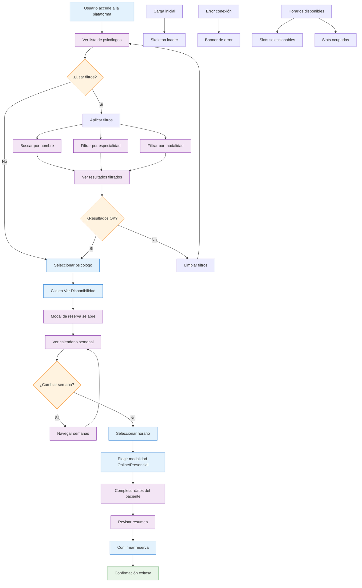

# 🤺 Psimammoliti Challenge

## 1. Instrucciones

Para ejecutar este proyecto, sigue estos pasos:

1.  **Clona el repositorio:**
    ```bash
    git clone <URL_DEL_REPOSITORIO>
    cd psimammoliti-challenge
    ```

2.  **Instala las dependencias:**
    Este proyecto utiliza `npm`. Asegúrate de tener Node.js instalado.
    ```bash
    npm install
    ```

3.  **Configura las variables de entorno:**
    Crea un archivo `.env` en la raíz del proyecto y añade las siguientes variables:

    *   `NEXT_PUBLIC_SUPABASE_URL`: La URL de tu instancia de Supabase.
    *   `NEXT_PUBLIC_SUPABASE_ANON_KEY`: La clave anónima de tu instancia de Supabase.

    Asegúrate de que Supabase esté configurado correctamente con las tablas y datos necesarios.

4.  **Ejecuta la aplicación en modo desarrollo:**
    ```bash
    npm run dev
    ```

    Esto iniciará el servidor de desarrollo de Next.js. Abre tu navegador y visita `http://localhost:3000` para ver la aplicación en funcionamiento.

5.  **Ejecuta los scripts SQL (opcional):**
    Si necesitas inicializar la base de datos o añadir datos de ejemplo, puedes ejecutar los scripts SQL ubicados en la carpeta `scripts`. Utiliza la herramienta de línea de comandos de Supabase o cualquier cliente SQL para ejecutar estos scripts en tu base de datos.

## 2. Decisiones técnicas y funcionales

*   **Framework:** Se utiliza Next.js para el frontend debido a su renderizado del lado del servidor (SSR), enrutamiento fácil y optimización del rendimiento.
*   **Componentes de la interfaz de usuario:** Se utiliza la biblioteca Shadcn/ui para los componentes de la interfaz de usuario, lo que garantiza la coherencia visual y la accesibilidad.
*   **Base de datos:** Se utiliza Supabase como base de datos y backend como servicio (BaaS) debido a su facilidad de uso, escalabilidad y capacidades en tiempo real.
*   **Gestión de estado:** Se utilizan los hooks de React (`useState`, `useEffect`, `useMemo`) para gestionar el estado de la aplicación y optimizar el rendimiento.
*   **Diseño responsivo:** Se utiliza Tailwind CSS para crear un diseño responsivo que se adapte a diferentes tamaños de pantalla, con especial atención a la experiencia móvil.
*   **Librería de iconos:** Se utiliza `lucide-react` para los iconos.

## 3. Detalle de lo que se hizo y se asumió

* Se armó un prototipo inicial con las siguientes tecnologías:
  * v0 — no-code tool
  * Supabase — Database provider
  * Vercel — deployent y continuos integration
  * Cursor — editor de código
  * GitHub — versionado de cambios

## 4. Documento funcional

1. **Flowchart** — Qué se puede hacer y cómo


2. Flujos cubiertos

### 👥 **Visualización de Psicólogos**
- Lista completa de psicólogos disponibles en tarjetas responsivas
- Información detallada: nombre, foto, experiencia, calificación, especialidades, descripción, precio y modalidades
- Indicadores de disponibilidad en cada tarjeta

### 🔍 **Sistema de Filtros y Búsqueda**
- Búsqueda en tiempo real por nombre o especialidad
- Filtros por especialidad específica (Fobias, Depresión, Ansiedad Social, etc.)
- Filtros por modalidad (Online/Presencial/Todas)
- Badges visuales para filtros activos y contador de resultados

### 📅 **Sistema de Reservas**
- Calendario semanal con navegación entre semanas
- Horarios mostrados en zona horaria local del usuario
- Selección de modalidad (online/presencial) por slot
- Formulario de paciente con validación
- Resumen de cita antes de confirmar

### ⏰ **Gestión de Horarios**
- Detección automática de zona horaria del navegador
- Conversión de horarios UTC a hora local
- Ocultación automática de horarios pasados
- Indicadores visuales para diferentes estados de disponibilidad

### ✅ **Proceso de Confirmación**
- Confirmación inmediata de reserva con modal detallado
- Información específica según modalidad elegida
- Instrucciones claras para el día de la sesión

### 📱 **Características Técnicas**
- Diseño completamente responsivo (desktop, tablet, móvil)
- Interfaz en español con formatos localizados
- Navegación por teclado y compatibilidad con lectores de pantalla

### 🚫 **Limitaciones Actuales**
- No incluye procesamiento de pagos
- No requiere autenticación de usuario
- No mantiene historial de reservas
- No permite cancelaciones o modificaciones
- No envía notificaciones automáticas
- No incluye sistema de videollamadas integrado