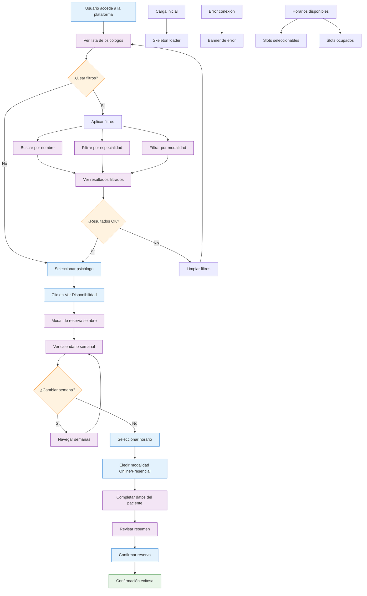

# 🤺 Psimammoliti Challenge

## 1. Instrucciones

### Deployment

- URL: https://psimammoliti-challenge.francosbenitez.com/

### Levantar localmente

1.  Clonar repo
    ```bash
    git clone <URL_DEL_REPOSITORIO>
    cd psimammoliti-challenge
    ```

2.  Instalar dependencias

    Este proyecto usa `npm`. Requiere tener Node instalado
    ```bash
    npm install
    ```

3.  Configurar variables de entorno

    Crear un archivo `.env` en la raíz del proyecto y agregá estas variables:

    *   `NEXT_PUBLIC_SUPABASE_URL`: La URL de tu instancia de Supabase
    *   `NEXT_PUBLIC_SUPABASE_ANON_KEY`: La clave anónima de la instancia de Supabase

4.  Ejecutar app
    ```bash
    npm run dev
    ```

    `http://localhost:3000` para ver la aplicación funcionando

5.  **Ejecutar scripts SQL (opcional):**
    Usar la herramienta de línea de comandos de Supabase o cualquier cliente SQL para generar datos reales en la base de datos.

## 2. Decisiones técnicas, funcionales, lo que se hizo y se asumió

* Se armó un prototipo inicial con las siguientes tecnologías:
  * **v0:** No-code tool muy fácil de usar, intuitiva y perfecta para armar prototipos funcionales rápido
  * **Supabase:** Fácil integración con v0 y buen dashboard para visualización de datos
  * **Vercel:** Fácil integración con el resto del stack, fácil despliegue, buen ecosistema
  * **Cursor:** IDE integrado con IA para debuggear y añadir features rápido
  * **GitHub:** Versionado de cambios

El prototipo cumple funcionalmente con los requerimientos. Estaría listo para salir a testear con usuarios y empezar a validar diferentes hipótesis.

Se asumió:
- La necesidad de un MVP que sirva para testear algunas ideas iniciales
- Saber que como MVP, va a estar sujeto a cambio con base en la interacción el usuario, por lo cual toda la infrastructura debe ser fácilmente iterable (ej., no debe estar sobre una arquitectura demasiado compleja de luego modificar)

## 3. Documento funcional

### 1. Flowchart: Qué se puede hacer y cómo


### 2. Flujos cubiertos

**Visualización de psicólogos**
- Lista completa de psicólogos disponibles en tarjetas responsivas
- Información detallada: nombre, foto, experiencia, calificación, especialidades, descripción, precio y modalidades
- Indicadores de disponibilidad en cada tarjeta

**Sistema de filtros y búsqueda**
- Búsqueda en tiempo real por nombre o especialidad
- Filtros por especialidad específica (Fobias, Depresión, Ansiedad Social, etc.)
- Filtros por modalidad (Online/Presencial/Todas)
- Badges visuales para filtros activos y contador de resultados

**Sistema de reservas**
- Calendario semanal con navegación entre semanas
- Horarios mostrados en zona horaria local del usuario
- Selección de modalidad (online/presencial) por slot
- Formulario de paciente con validación
- Resumen de cita antes de confirmar

**Gestión de horarios**
- Detección automática de zona horaria del navegador
- Conversión de horarios UTC a hora local
- Ocultación automática de horarios pasados
- Indicadores visuales para diferentes estados de disponibilidad

**Proceso de confirmación**
- Confirmación inmediata de reserva con modal detallado
- Información específica según modalidad elegida
- Instrucciones claras para el día de la sesión

**Características técnicas**
- Diseño completamente responsivo (desktop, tablet, móvil)
- Interfaz en español con formatos localizados
- Navegación por teclado y compatibilidad con lectores de pantalla

**Lo que no se incluye en el MVP**
- No incluye procesamiento de pagos
- No requiere autenticación de usuario
- No mantiene historial de reservas
- No permite cancelaciones o modificaciones
- No envía notificaciones automáticas
- No incluye sistema de videollamadas integrado