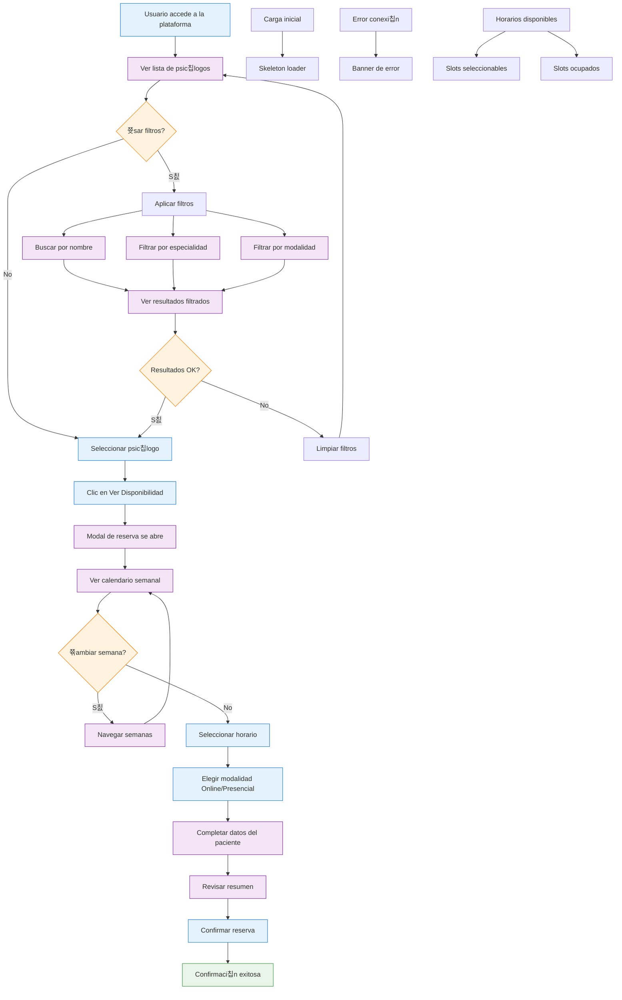
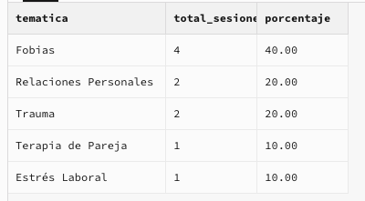
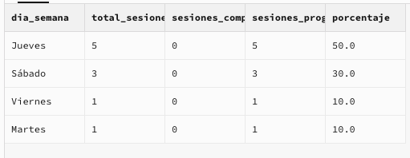
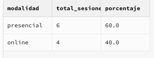

# 🤺 Psimammoliti Challenge

### 1. Instrucciones

#### Deployment

- Preview URL: https://psimammoliti-challenge.francosbenitez.com/

#### Levantar localmente

1.  Clonar repo
    ```bash
    git clone <URL_DEL_REPOSITORIO>
    cd psimammoliti-challenge
    ```

2.  Instalar dependencias

    Este proyecto usa `npm`. Requiere tener Node instalado
    ```bash
    npm install
    ```

3.  Configurar variables de entorno

    Crear un archivo `.env` en la raíz del proyecto y agregá estas variables:

    *   `NEXT_PUBLIC_SUPABASE_URL`: La URL de tu instancia de Supabase
    *   `NEXT_PUBLIC_SUPABASE_ANON_KEY`: La clave anónima de la instancia de Supabase

4.  Ejecutar app
    ```bash
    npm run dev
    ```

    `http://localhost:3000` para ver la aplicación funcionando

5.  Ejecutar scripts SQL (opcional)

    Usar la herramienta de línea de comandos de Supabase o cualquier cliente SQL para generar datos reales en la base de datos.

#### Ejecutar tests

Para ejecutar los tests de Playwright localmente:

```bash
# Instalar dependencias de Playwright (solo la primera vez)
npx playwright install

# Ejecutar tests en navegadores específicos
npx playwright test --project=chromium
npx playwright test --project=firefox
npx playwright test --project=webkit
```

### 2. Decisiones técnicas, funcionales, lo que se hizo y se asumió

Se armó un prototipo inicial con las siguientes tecnologías:
  * **v0:** No-code tool muy fácil de usar, intuitiva y perfecta para armar prototipos funcionales rápido
  * **Supabase:** Fácil integración con v0 y buen dashboard para visualización de datos
  * **Vercel:** Fácil integración con el resto del stack, fácil despliegue, buen ecosistema
  * **Cursor:** IDE integrado con IA para debuggear y añadir features rápido
  * **GitHub:** Versionado de cambios

El prototipo cumple funcionalmente con los requerimientos. Estaría listo para salir a testear con usuarios y empezar a validar diferentes hipótesis.

Se asumió:
1. La necesidad de un MVP que sirva para testear algunas ideas iniciales
2. Saber que como MVP, va a estar sujeto a cambio con base en la interacción el usuario, por lo cual toda la infrastructura debe ser fácilmente iterable (ej., no debe estar sobre una arquitectura demasiado compleja de luego modificar)

### 3. Documento funcional

#### 1. Flowchart


#### 2. Flujos cubiertos

1. Visualización de psicólogos
    - Lista completa de psicólogos disponibles en tarjetas responsivas
    - Información detallada: nombre, foto, experiencia, calificación, especialidades, descripción, precio y modalidades
    - Indicadores de disponibilidad en cada tarjeta
    - Mostrar psicólogos con poca disponibilidad

2. Sistema de filtros y búsqueda
    - Búsqueda en tiempo real por nombre o especialidad
    - Filtros por especialidad específica (Fobias, Depresión, Ansiedad Social, etc.)
    - Filtros por modalidad (Online/Presencial/Todas)
    - Badges visuales para filtros activos y contador de resultados

3. Sistema de reservas
    - Calendario semanal con navegación entre semanas
    - Horarios mostrados en zona horaria local del usuario
    - Selección de modalidad (online/presencial) por slot
    - Formulario de paciente con validación
    - Resumen de cita antes de confirmar

4. Gestión de horarios
    - Detección automática de zona horaria del navegador
    - Conversión de horarios UTC a hora local
    - Ocultación automática de horarios pasados
    - Indicadores visuales para diferentes estados de disponibilidad

5. Proceso de confirmación
    - Confirmación inmediata de reserva con modal detallado
    - Información específica según modalidad elegida
    - Instrucciones claras para el día de la sesión

### 4. Consultas SQL

1. 쯈ué temática es más consultada?

```sql
SELECT 
    s.name as tematica,
    COUNT(ses.id) as total_sesiones,
    ROUND(
        (COUNT(ses.id) * 100.0 / (
            SELECT COUNT(*) 
            FROM sessions 
            WHERE status IN ('completed', 'scheduled')
        )), 2
    ) as porcentaje
FROM specialties s
JOIN sessions ses ON s.id = ses.specialty_id
WHERE ses.status IN ('completed', 'scheduled')
GROUP BY s.id, s.name
ORDER BY total_sesiones DESC;
```




2. 쯈ué día tiene más sesiones?

```sql
SELECT 
    CASE 
        WHEN EXTRACT(DOW FROM session_date) = 0 THEN 'Domingo'
        WHEN EXTRACT(DOW FROM session_date) = 1 THEN 'Lunes'
        WHEN EXTRACT(DOW FROM session_date) = 2 THEN 'Martes'
        WHEN EXTRACT(DOW FROM session_date) = 3 THEN 'Miércoles'
        WHEN EXTRACT(DOW FROM session_date) = 4 THEN 'Jueves'
        WHEN EXTRACT(DOW FROM session_date) = 5 THEN 'Viernes'
        WHEN EXTRACT(DOW FROM session_date) = 6 THEN 'Sábado'
    END as dia_semana,
    COUNT(*) as total_sesiones,
    COUNT(CASE WHEN status = 'completed' THEN 1 END) as sesiones_completadas,
    COUNT(CASE WHEN status = 'scheduled' THEN 1 END) as sesiones_programadas,
    ROUND(
        (COUNT(*) * 100.0 / (SELECT COUNT(*) FROM sessions WHERE status IN ('completed', 'scheduled'))), 
        1
    ) as porcentaje
FROM sessions
WHERE status IN ('completed', 'scheduled')
GROUP BY EXTRACT(DOW FROM session_date)
ORDER BY total_sesiones DESC;
```



3. 쯈ué modalidad es más usada?

```sql
SELECT 
    modality as modalidad,
    COUNT(*) as total_sesiones,
    ROUND(
        (COUNT(*) * 100.0 / (SELECT COUNT(*) FROM sessions WHERE status IN ('completed', 'scheduled'))), 
        1
    ) as porcentaje
FROM sessions
WHERE status IN ('completed', 'scheduled')
GROUP BY modality
ORDER BY total_sesiones DESC;
```



## Conclusión

El prototipo apuntó a cumplir con los requerimientos funcionales básicos para un MVP, implementando un sistema de visualización, filtrado, reserva y gestión de horarios. La arquitectura permite iteraciones rápidas y un despliegue sencillo. El stack facilitó tanto el desarrollo inicial como las futuras mejoras y se adaptó al cambio sin mayores inconvenientes.